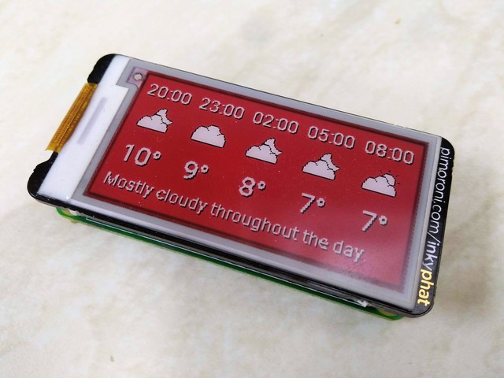

# Raspberry Pi / Inky pHAT Weather Board

Show the weather on an e-ink [Inky pHAT](https://shop.pimoroni.com/products/inky-phat?variant=12549254217811) display with a Raspberry Pi.

This can be deployed using [Balena Cloud](https://www.balena.io/cloud). Follow their [getting started guide](https://www.balena.io/docs/learn/getting-started/raspberrypi3/nodejs/) but `git push balena master` this project instead. 

The weather is provided by [Dark Sky](https://darksky.net/dev), and you'll need to provide an api key as an environment variable called `DS_KEY`. This can be set in the Balena Cloud dashboard using a [service variable](https://www.balena.io/docs/learn/manage/serv-vars/).

The following envs are available to set:

- DS_KEY=xxx
- DS_LAT_LNG=50.821,-0.151
- ROTATE_180=true
- TIMEZONE=Europe/London

The weather will update once an hour, on the hour.

Note this has not been tested with the other color variants of the Inky pHAT and will probably need code changes to work. PRs welcome. 

